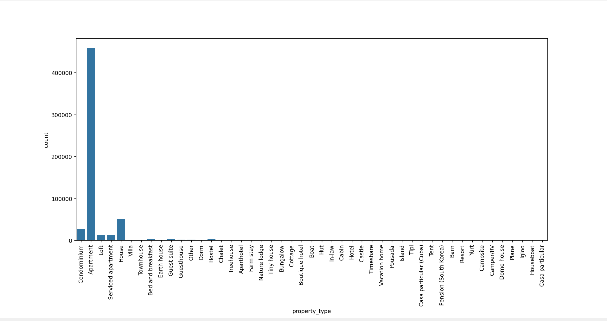
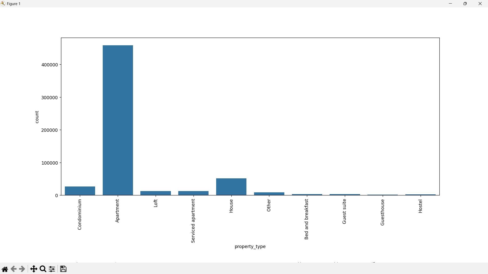

# Group 'property_type'

Starting with the 'property_type' collumn, we will group all the entires will less than 2000 entries into the 'Other' category since they had a significant amount of categories and their low numbers would make the model more complex and less efficient.

Before grouping

```python
bar_graph_string('property_type')
```



After grouping all categories with less than 2000 entries into a single 'Other' category:

```python
group_categories('property_type', 'Other', 2000)
bar_graph_string('property_type')
```


