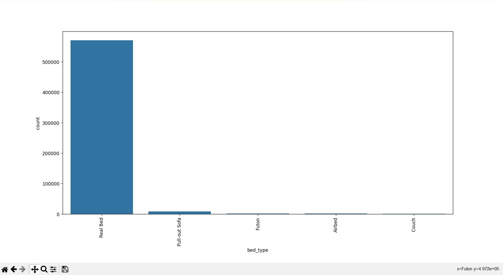
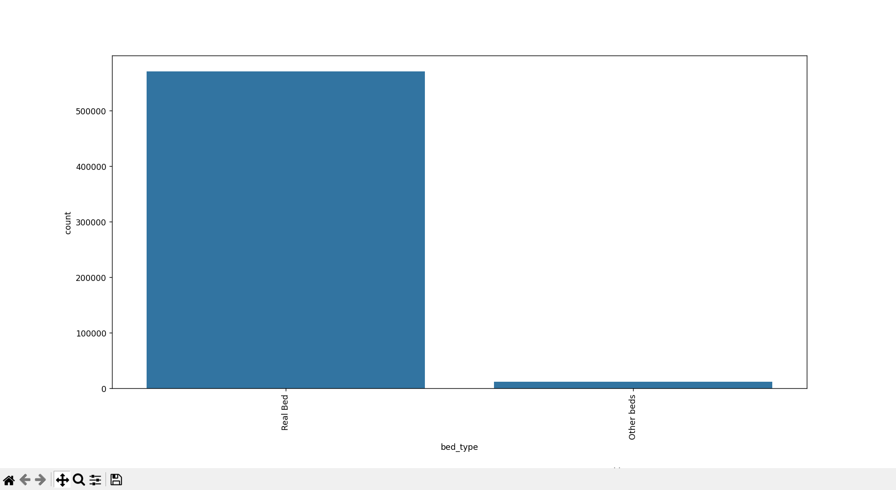

# Group 'bed_type'

Next, the 'bed_type' collumn only has 5 categories, however only the 'real_bed' category has significant values, while the others have small, broken values. Therefore, we will group all these entries into a 'Other beds' category. (The amount 10,000 was chosen simply to choose the remaining categories)

Before grouping:

```python
bar_graph_string('bed_type')
```



After grouping all categories with less than 10,000 values:

```python
group_categories('bed_type', 'Other beds', 10000)
bar_graph_string('bed_type')
```


