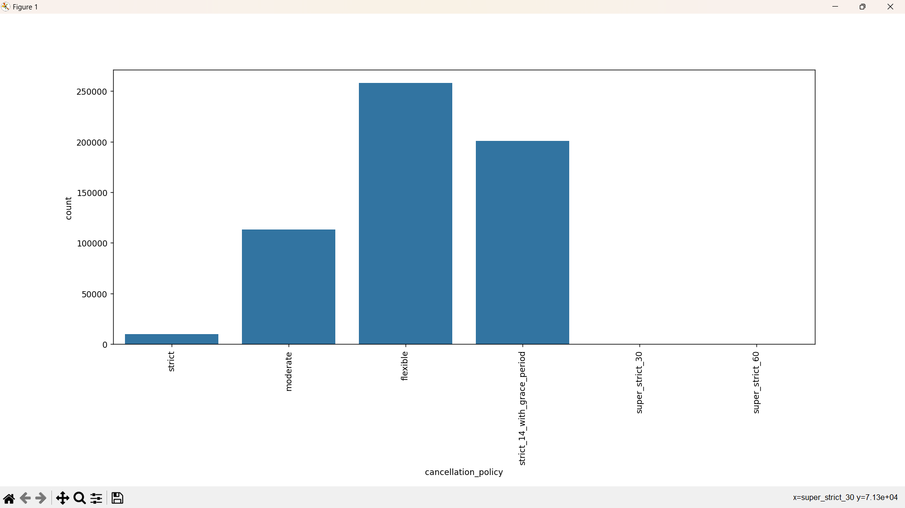
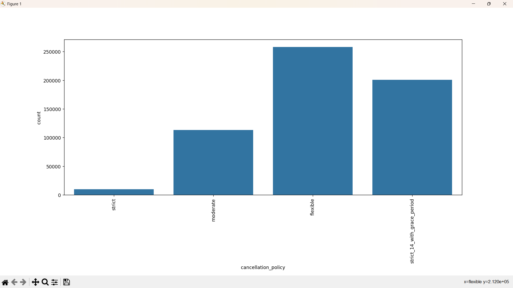

# Group 'cancellation_policty'

Following up, the 'cancellation_policy' collumn has 3 categories (strict, super_strict_60, super_strict_30) that contain small values in comparison to the rest. Therefore we will group all these entries into the 'strict' category.

Before:

After grouping said categories into the 'strict' category

