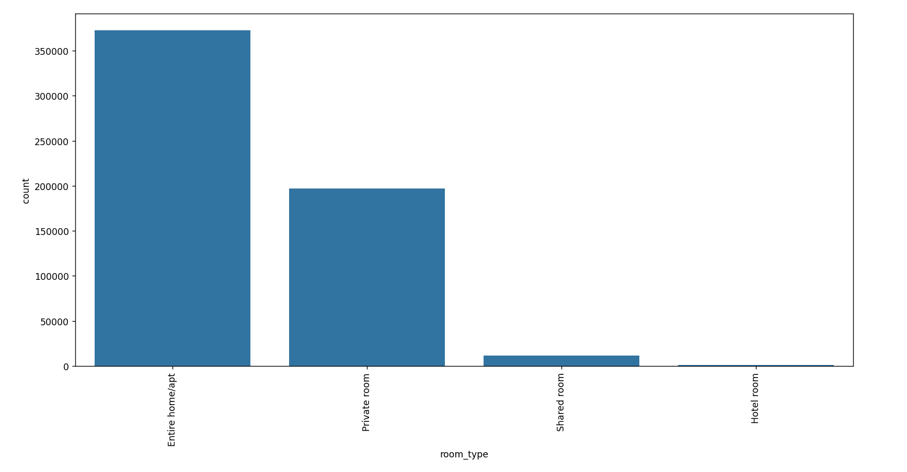

# Group room_type

Finally, the 'room_type' collumn only has 4 categories whithout any major value discrepancies in the data (only two categories have significant smaller values), so no change/grouping of categories will be needed.

```python
bar_graph_string('room_type')
```


