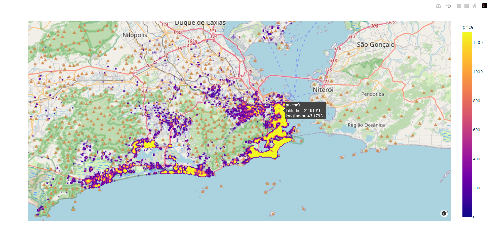
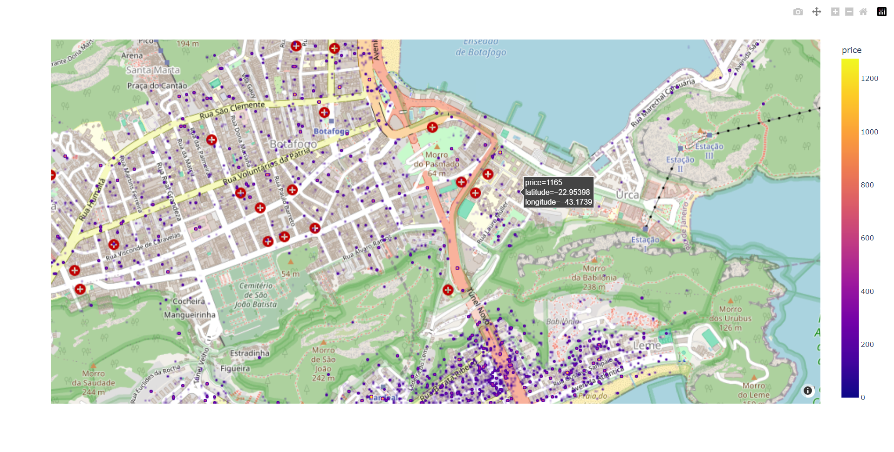

# Loading the map into the browser

In order to load all of the data into the browser, we will save the map as an html file, then open it in the browser.

```python
with open('map.html', 'w', encoding = 'utf-8') as f :
    f.write(map_graph.to_html())

webbrowser.open(os.path.realpath('map.html'))
```




