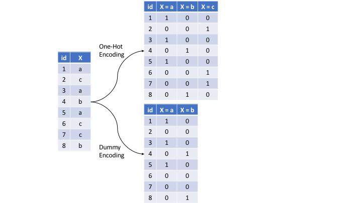

# Encoding explanation

We need to adjust some non-numerical columns to facilitate the machine learning model's analysis as it can only analyze numbers.

There are two types of data inside these columns: Categories and True or False

Booleans will become 0 (false) and 1 (true)

Categories will be encoded using dummy encoding (creates columns for each category and applies binary values based if they are in the category or not). This process can be visualized in the image below:

