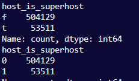

# Encoding booleans

First, we will create a copy of the dataframe to not accidentaly alter the original:

```python
main_dataframe_coded = main_dataframe.copy()
```

The collumns 'host_is_superhost', 'instant_bookable', and 'is_business_travel_ready' already contain only 'f' and 't' values, so we will utilize the .map function to substitute those values with zeros and ones respectively.

```python
#* Encoding booleans
for collumn in ['host_is_superhost', 'instant_bookable', 'is_business_travel_ready'] :
    main_dataframe_coded[collumn] = main_dataframe[collumn].map({'f':0, 't':1})
```

Result before and after:


