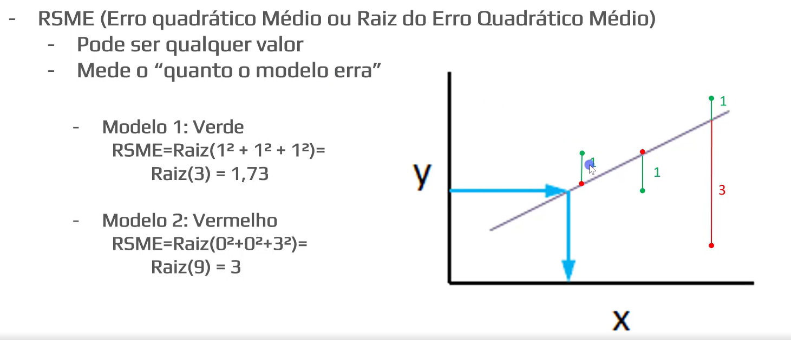

# Choosing the metrics to evaluate the model

We will utilize two statistical metrics to evaluate the accuracy of the model:

1. **R²** - ranges from 0 to 1, measuring how much of the variation of data the model can explain
2. **Root Mean Square Error (RSME) -** says how much the model is off

