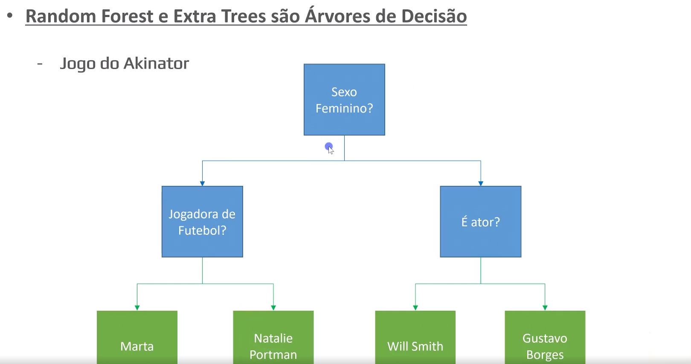

# Choosing which models we are going to use

As mentioned previously, we will use and analyze three different models:

1) **Linear Regression** - traces a line that minimizes the erros, values closer to the line are better, not efficient with weak/no correlations

2) **Random Forest Regressor - Decision trees -** doing questions separating the data into different groups, random forest regressor uses multiple decision trees with random smaller parts of the data and calculates the mean to reach the final result

3) **Extra Trees** - Same as random forest regressor, however the random forest chooses the best question (that will filter the most data) while extra trees asks a random question (which could work best depending on the question)

**Example:** The Random Forest and Extra trees models utilize decision trees that are widely used in certain cenarios such as in the guessing game Akinator (the picture below displays the machine learning model's decision tree that branches after each question made).

