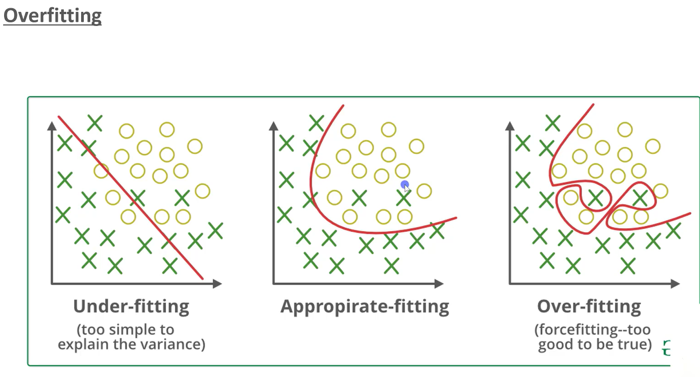

# Training and testing the models

In order to train and test our models we will have to randomly separate our data into two sets: training and testing data

* Training data will be used for the model to know what values to analyze (x variable in the equation will be the properties' features) and what it wants to calculate (y variable in the equation will be the price of the property)
* Testing data will be used for the model to analyze new data and check its accuracy after it is fully trained

**Obs:** To address overfitting, an 80-20 data split strategy is employed, where 80% of the dataset is allocated for training and 20% for testing. This approach ensures rigorous evaluation of the model's generalization ability by assessing its performance on unseen data. By separating datasets for training and testing, the model's tendency to overly adapt to training data nuances is mitigated, thereby enhancing its efficacy in handling new data. The image below demonstrates the three types of fitting present in the training of machine learning models:

