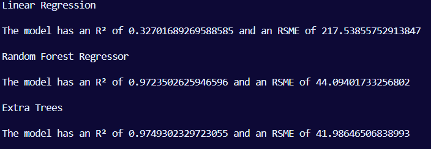

# Choosing the best model

Here are the results once more:

Following the evaluation of all model outputs, the Extra Trees model was selected as the most effective among the tested algorithms.

Although the linear regression model exhibited the fastest computation time, it recorded a notably low R² value of 32%, indicating a weak fit to the data.

Additionally, the Extra Trees and Random Forest models demonstrated similar R² values, suggesting comparable levels of predictive accuracy. However, the Random Forest model incurred a higher Root Mean Square Error (RMSE) and required substantially more computational time compared to the Extra Trees model, further supporting the selection of the latter for optimal performance.
