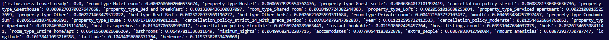

# Analyzing the best model

In order to analyze how the model works, we need to observe the importance of each feature the model uses when calculating the final price.

```python
feature_importance_dict = dict(zip(x_train.columns, extra_trees_model.feature_importances_ ))
sorted_feature_importance_dict = sorted(feature_importance_dict.items(), key=lambda x:x[1])
feature_importance_dict = dict(sorted_feature_importance_dict)

print(feature_importance_dict)
```

A dictionary in ascending order with the importance (in percentage) of each feature is printed as a result:



After observing the influence of each feature, we can observe the relevance of the localization as the longitude and latitude account for 20% of the data used in the calculations for the price. Also, the amount of ammenities bedrooms are another crucial factors in the price definition as the houses become more attractive to customers, therefore increasing its prices.

However, other features such as 'is_buisness_travel_ready' have no relevance when calculating the final price, therefore we will experiment removing them to test if the model becomes more efficient.
