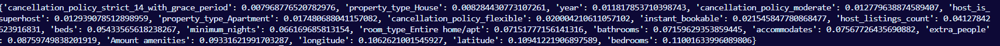

# Adjusting an improving the best model

Due to the large amount of columns present in the model's analysis, we will remove all of the features that have an importance of less than **0.007%**. This will remove a large amount of redundant data in the model's analysis, making it considerably more efficient.

Also, after the removal, there will only be one 'room_type' column (the 'room_type_Entire home/apt'). So, in order to add more flexibility for the user when choosing a room type, we will keep the '**room_type_Private room**' column which had the second highest importance.

```python
room_type_private_room = main_dataframe_coded['room_type_Private room']

for column in feature_importance_dict :
    if feature_importance_dict[column] < 0.007 :
        print(f"Removed {column}")
        main_dataframe_coded = main_dataframe_coded.drop(column, axis=1)

main_dataframe_coded['room_type_Private room'] = room_type_private_room

#? Separating the new data
y, x = (main_dataframe_coded['price'], main_dataframe_coded.drop('price', axis=1))
x_train, x_test, y_train, y_test = train_test_split(x, y, random_state=20)
```


We will now create a new final Extra Trees model with the new data and observe its performance.

```python
final_model = ExtraTreesRegressor()

final_model.fit(x_train, y_train)
prediction = final_model.predict(x_test)
analyze_model(prediction, y_test)

#? creating a new dictionary for the updated features
feature_importance_dict_final = dict(zip(x_train.columns, final_model.feature_importances_))
sorted_feature_importance_dict = sorted(feature_importance_dict_final.items(), key=lambda x:x[1])
feature_importance_dict_final = dict(sorted_feature_importance_dict)
print(feature_importance_dict_final)
```

The results are shown below:


After removing the 'is_buisness_ready' collumn the **R²** increased slightly while the **RSME** decreased, signifying a improvment in the model's accuracy.


After removing the **'property_type'** and **'bed_type'** collumns the models accuracy slightly decreased, however its simplicity and efficiency had a **significant improvement**.





Lastly, the model's accuracy barely changed after removing all collumns with less than 0.007% of importance, however its **efficiency** and **simplicity** has **improved significantly** (from taking approximately **5 minutes** to test down to less than **2 minutes**)
