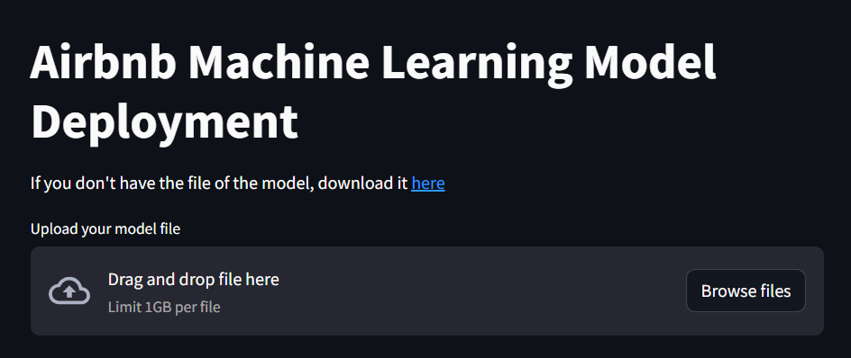

# Setting up page and config

Setting up the page title and icon:

```python
st.set_page_config(page_title="Airbnb Deployment", page_icon=":shark:")
st.title("Airbnb Machine Learning Model Deployment")
```

We will add a link to a google drive containing joblib file of the prediction model for download in case the user doesn't have it already installed on their computer. The following link was used: [https://drive.google.com/file/d/1VMhrCh5l2neipciZF15Y1lBDS02lgeN5/view?usp=sharing](https://drive.google.com/file/d/1VMhrCh5l2neipciZF15Y1lBDS02lgeN5/view?usp=sharing)

```python
st.write("If you don't have the file of the model, download it [here](https://drive.google.com/file/d/1VMhrCh5l2neipciZF15Y1lBDS02lgeN5/view?usp=sharing)")
```

**Obs:** On streamlit, use [text] (link) to add a specific link to a text.

Next, we will add a upload box for the user to upload the joblib file:

```python
model_file = st.file_uploader("Upload your model file", accept_multiple_files=False)
```

However, the default upload limit in streamlit is **200 MB** and our file is over **400 MB**. In order to fix this, we will go to the .streamlit folder and inside the config.toml file write the following code:

```
[server]
maxUploadSize = 600
maxMessageSize = 600
```

**Obs:** If said files are not present on the folder of your main project, create them with the same exact names.

The streamlit page looks like this now:


