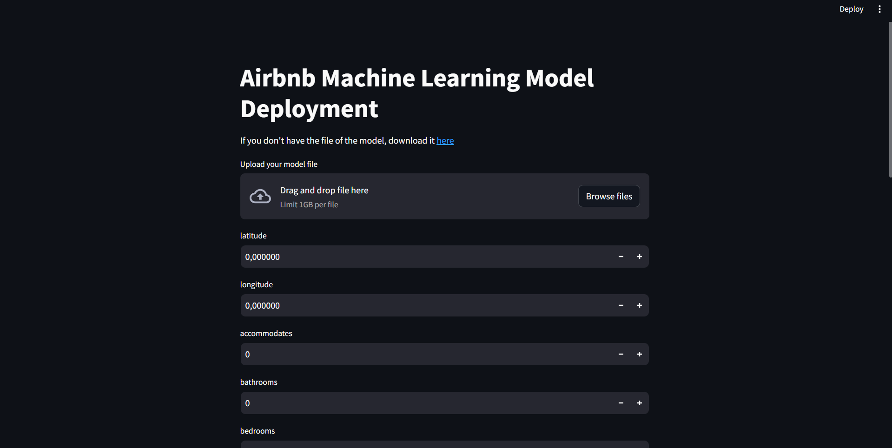

# Creating the buttons

Now we will create a button for each dictionary and updating the values after the user's input.

Some buttons such as the latitude and logitude, will have float values and others will have integer, we will adjust their values as needed.

```python
for item in x_numerical :
    if item == 'latitude' or item == 'longitude' :
        value = st.number_input(f'{item}', step=0.000001, value=0.0, format="%.6f")
    elif item == 'extra_people' :
        value = st.number_input(f'{item}', step=0.01, value = 0.0) #? default decimal places for floats are already two, so no format is needed
    else :
        value = st.number_input(f'{item}', step = 1, value = 0)
    x_numerical[item] = value

for item in x_boolean :
    value = st.selectbox(f'{item}', ('Yes', 'No'))
    if value == 'Yes' :
        x_boolean[item] = 1
    else :
        x_boolean[item] = 0
```

We will iterate over each element of the list_value dictionary, as it is the one that stores the values the user enters

```python
for item in x_lists :
    value = st.selectbox(f'{item}', x_lists[item])
    list_values[f'{item}_{value}'] = 1
```

The streamlit website looks contains the buttons now:


