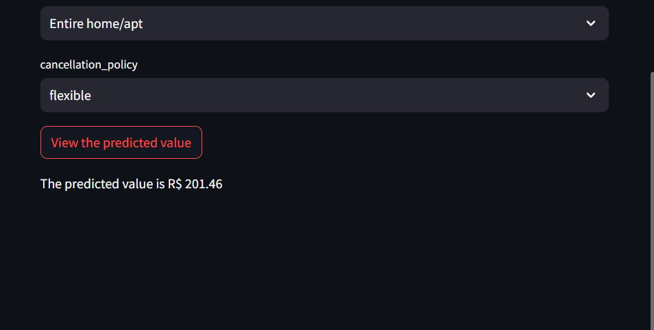

# Creating the preview value button

Lastly, we will create a button for the user to see the predicted value:

```python
preview_button = st.button("View the predicted value")
```

Once the user clicks the button, we will join the list_values, x_numerical and x_boolean dictionaries updated by the user's input and will create a new Dataframe out of it for the machine learning model to use.

```python
if preview_button :
    list_values.update(x_numerical)
    list_values.update(x_boolean)

    x_value_dataframe = pd.DataFrame(list_values, index = [0])
```

As the data has to be in the same order as the data the model trained upon, we will create a list containing the columns in the same order (excluding the first column which is for indexing and the last column ('Price') which was implemented after the training). The column order list will be used to rearrange the columns in the dataframe:

```python
    data = pd.read_csv("final_data.csv")
    column_order_list = list(data.columns)[1:-1]

    x_value_dataframe = x_value_dataframe[column_order_list]

    #? Loading the model and making the prediction
    model = joblib.load(model_file)
    prediction = model.predict(x_value_dataframe)

    st.write(f"The predicted value is R$ {prediction[0]:.2f}")
```

**Obs:** All of the code block above is located whithin the preview_button condition!

Done! Now we can calculate the estimated price of a airbnb property given the values of the features that we choose on the website for the model!


