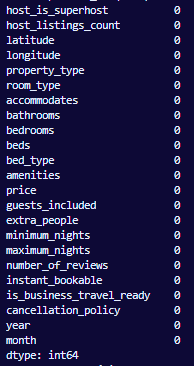

# Treating missing values

Utilizing the command:

```python
print(base_airbnb.isnull().sum())
```

We can see the amount of null values in each column:


If over 30% of the data is missing we will remove that collumn to optimize the model . Upon visualizing the dataset, it became apparent that certain columns contain a substantial amount of null values. Columns with over 30% of missing data will be entirely discarded, while those with fewer null values will undergo null value removal to ensure data integrity.

```python
row_30_percent = main_dataframe.shape[0] * 0.3
for collumn in main_dataframe :
    if main_dataframe[collumn].isnull().sum() >= row_30_percent :
        main_dataframe = main_dataframe.drop(collumn, axis=1)
```

After removing said columns we were left with these:

```python
print(base_airbnb.isnull().sum())
```


As there aren't a significant amount of null values left, we will remove them.

```python
main_dataframe = main_dataframe.dropna()
```

In the end, all columns left won't have any null values, effectively optimizing our dataset for further analysis, thereby maximizing the accuracy and reliability of our results.


