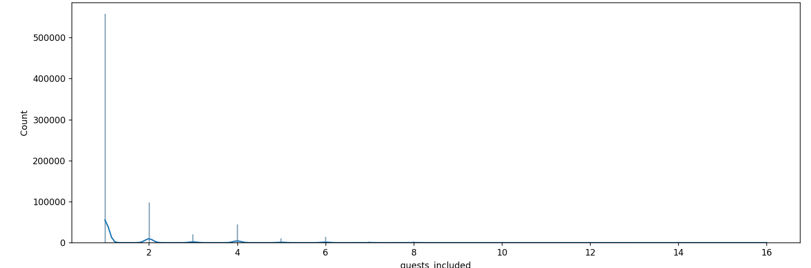

# Removing the 'guests_included' column

The 'guests_included' column will be disregarded from the model's analysis due to its significant skew towards a single value, specifically 1, indicating a maximum limit of one guest per residency.



Removing this column from the analysis as a whole is essential as excluding only the outliers could significantly influence the final result.

Moreover, this concentration likely stems from data entry errors, as typical housing accommodations should accommodate more than one person.

```python
main_dataframe = main_dataframe.drop('guests_included', axis = 1)
```
