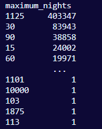

# Removing the 'maximum_nights' column

The 'maximum_nights' feature will be excluded from the model's analysis due to its negligible contribution to price variance. Furthermore, the data exhibits apparent randomness with disparate values across entries, suggesting rapid insertion by users, thus warranting its omission from the analytical framework.

```python
print(main_dataframe['maximum_nights'].value_counts())
```



```python
main_dataframe = main_dataframe.drop('maximum_nights', axis = 1)
```
