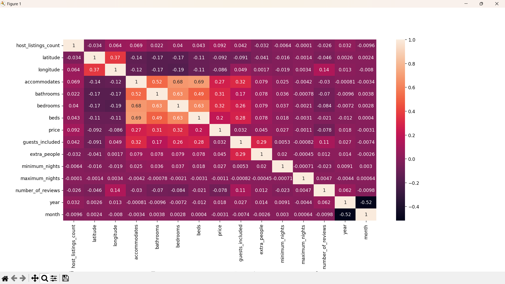

# Analyzing heatmap

In order to perform a correlation analysis among the features we will create a heatmap of the correlation coefficient of each feature:

```python
#* Making a heatmap from the correlation coefficient
plt.figure(figsize=(15,10))
plt.subplots_adjust(bottom=0.264)
sns.heatmap(main_dataframe.corr(numeric_only=True), annot=True)
plt.show()
```



None of the correlation coefficients observed among the features reached a strength indicative of redundancy for the prediction model (excluding the coefficient of 1 present in the comparison of same features).
