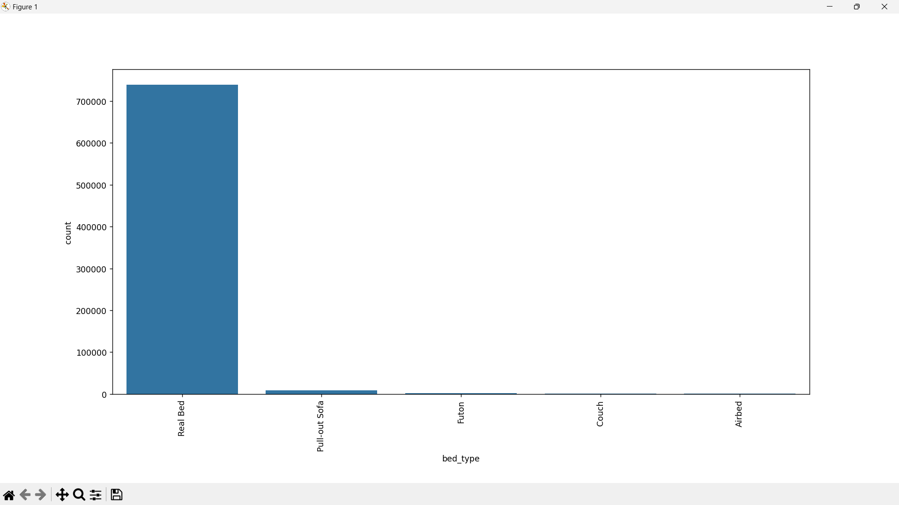
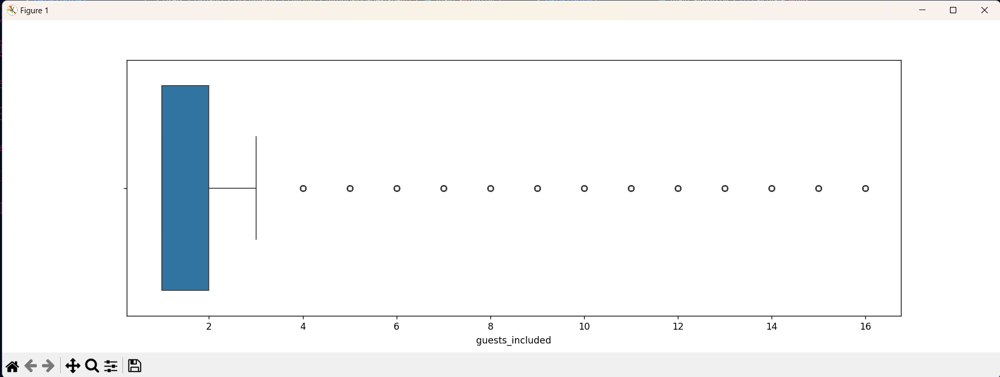
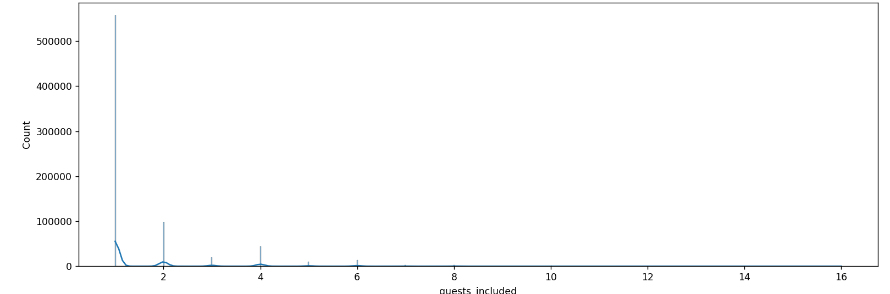
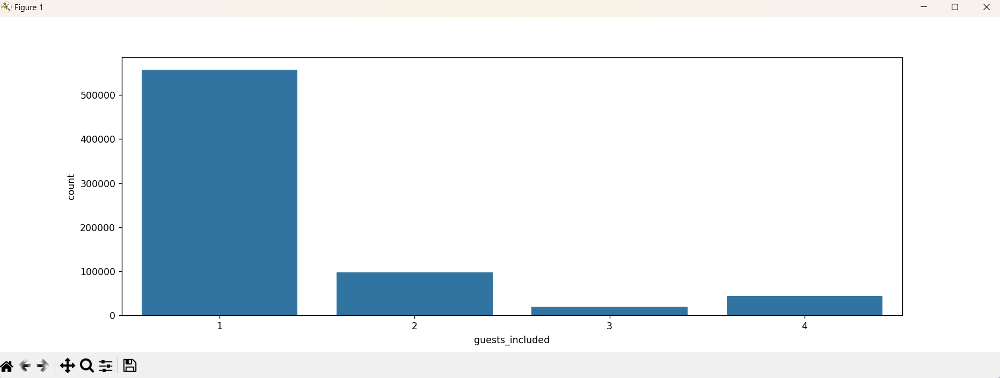

# Creating graphs

Now we will create four functions, each for visualizing a different type of graph and test them with the 'guests_included' column (except with the bar graph for string data):

1. Bar Graph for string data

   ```python
   def bar_graph_string(main_dataframe_collumn_name) :
       plt.figure(figsize=(15, 5))
       plt.subplots_adjust(bottom=0.3)
       bar_graph = sns.countplot(x=main_dataframe_collumn_name, data=main_dataframe)
       bar_graph.tick_params(axis='x', rotation=90)
       plt.show()

   bar_graph_string('bed_type')
   ```

   

   Now, the graphs below will only work properly for NUMERICAL data, as they utilize limits determined by quartiles. Also, notice how it will be necessary to pass the whole column as a parameter (ex: main_dataframe['guests_included']) instead of only passing the string name of the column as done in the bar graph for strings that recieved just the name string 'bed_type'.
2. Box plot

```python
   def box_plot(main_dataframe_collumn) :
       plt.figure(figsize=(15,5))
       plt.subplots_adjust(bottom=0.3)
       sns.boxplot(x = main_dataframe_collumn)
       plt.show()


   box_plot(main_dataframe['guests_included'])
```

   

3. Histogram

```python
   def histogram(main_dataframe_collumn) :
       plt.figure(figsize=(15, 5))
       plt.subplots_adjust(bottom=0.3)
       sns.histplot(x = main_dataframe_collumn, kde=True)
       plt.show()

   histogram(main_dataframe['guests_included'])
```

   

4. Bar graph

```python
   def bar_graph(main_dataframe_collumn) :
       plt.figure(figsize=(15, 5))
       plt.subplots_adjust(bottom=0.3)
       ax = sns.barplot(x = main_dataframe_collumn.value_counts().index, y = main_dataframe_collumn.value_counts())
       ax.set_xlim(calculate_limits(main_dataframe_collumn))
       plt.show()

   bar_graph(main_dataframe['guests_included'])
```

   
