# Airbnb Rio de Janeiro

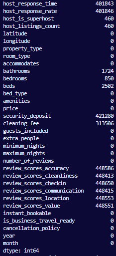 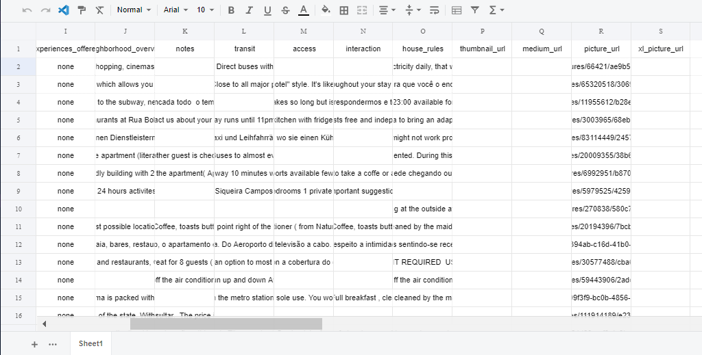

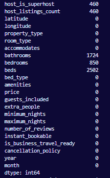

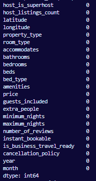

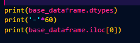

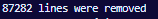 10% of the lines were outliers and were removed of the price collumn

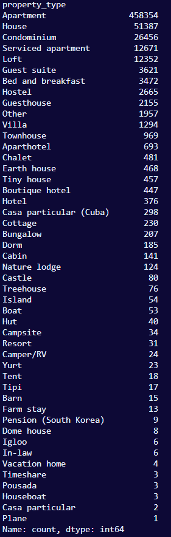

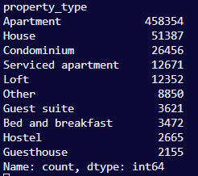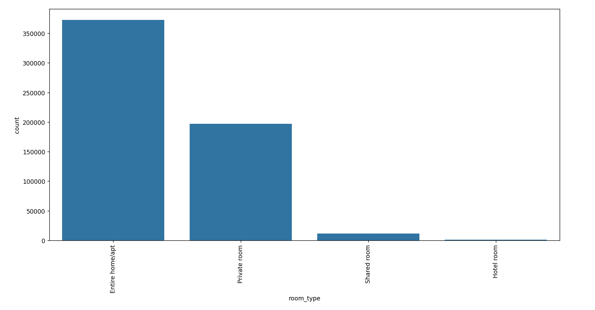

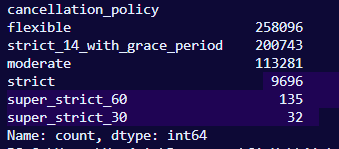

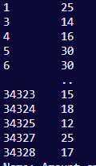

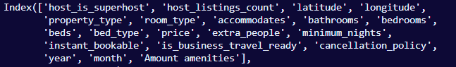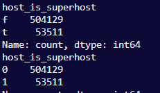

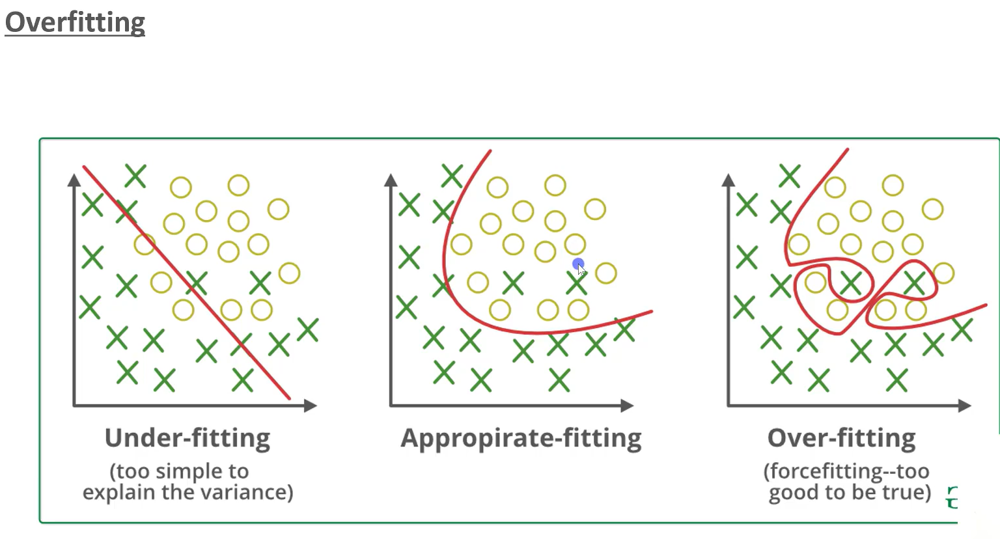

 Random forest

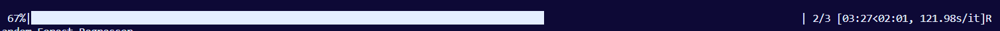

Extra trees

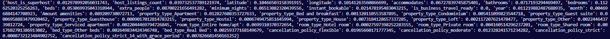

 after removing 'is_buisness_ready'

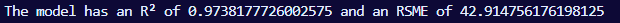 after removing property type and bed type

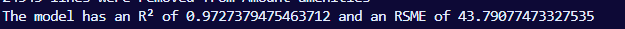 after removing all 0.007

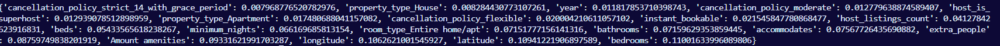

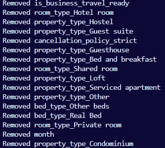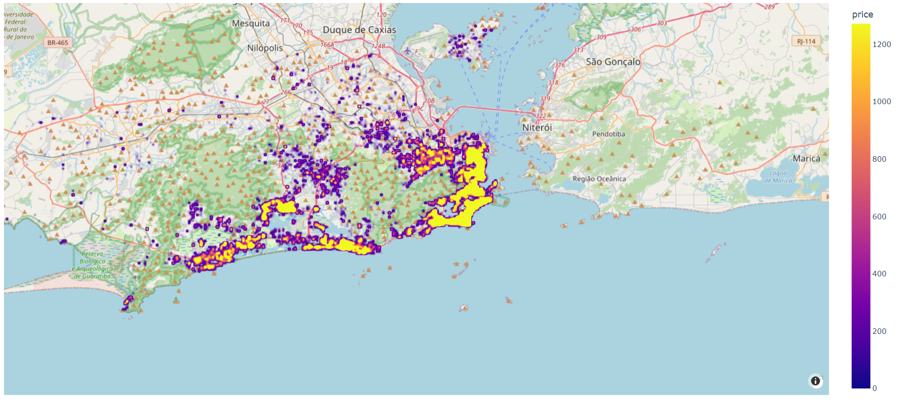
