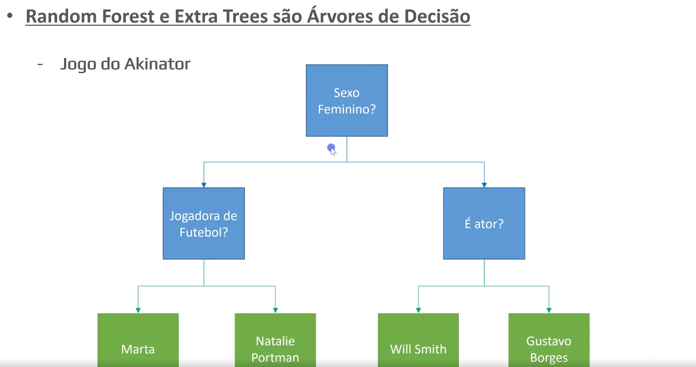
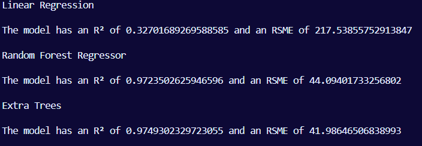
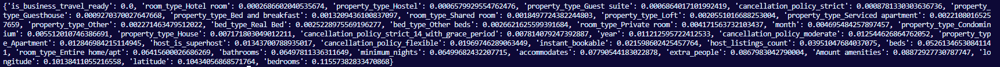

# Airbnb Rio de Janeiro

 

 10% of the lines were outliers and were removed of the price collumn

 Random forest

Extra trees

 after removing 'is_buisness_ready'

 after removing property type and bed type

 after removing all 0.007

