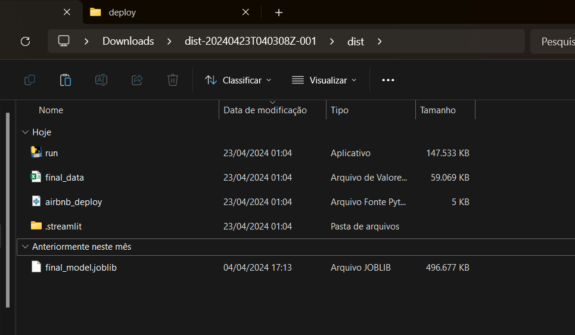

<h1 align="center">Rio de Janeiro Airbnb Price ML Predictor</h1>

  <i>This machine learning model utilizes supervised learning to predict the daily rental price for Airbnb properties!</i>
    
  
    
  <b><a href="https://drive.google.com/drive/folders/1q_4X9UAha5WXrZVSjj4235ktvcQOZNx6?usp=sharing">Download .exe folder</a></b> | <b><a href="https://airbnb-rio-de-janeiro.onrender.com/">Wikipedia</a></b> | <b><a href="https://github.com/Dante-Navaza2005">My profile</a></b> | <b><a href="https://www.linkedin.com/in/dante-navaza/">LinkedIn</a></b>
    
  
  
  
  
    
  

**IMPORTANT NOTE: For an in-depth look at the development process behind this project, check out the comprehensive wiki available at the header of the README or click [here](https://airbnb-rio-de-janeiro.onrender.com/). It covers every aspect of the project, from initial concept to final implementation.**

  
<b>Table of Contents</b>

* [Context and objective](#-Context-and-objective)
* [Features](#-features)
* [Adjustable parameters]()
* [Getting started](#-Getting-started)
  * [Download](#Download)
  * [Executing the file](#Executing-the-file)
  * [Video demonstration]()
* [Additional changes](#Additional-changes)
* [Thanks and contact](#-services)
* [License](#-license)

## 🌐 Context and objective

Airbnb allows anyone with a spare room or property of any type (apartment, house, chalet, inn, etc.) to list their property for rent on a daily basis.

As a host, you create your profile and list your property. In this listing, hosts should provide a comprehensive description of the property to assist renters/travelers in choosing the best accommodation and to make their listing more appealing.

There are numerous customizations available in the listing, ranging from minimum stay requirements, pricing, number of rooms, to cancellation policies, extra guest fees, identity verification requirements for renters, etc.

Our objective is to build a price prediction model that enables property owners to determine the appropriate daily rate for their property. Additionally, to assist renters in evaluating whether a listed property offers a competitive price compared to similar properties with similar characteristics.

## 🎯 Features

* 🤖  **Machine Learning** : Employs the Extra Trees algorithm in a supervised learning model for robust property price estimation.
* ⚡  **Real-Time** : Provides instant price predictions as you input data.
* 🌎  **Multi-Language** : Offers documentation and a website in multiple languages for broader accessibility.
* 🗂️  **Customizable** : Allows you to include various property features to refine model accuracy.
* 👌  **Simple Setup** : Get started quickly by downloading an executable folder and a joblib model file.
* 🚀  **High Speed** : Delivers price calculations within seconds. You can further boost performance by adjusting the joblib file's compression level (note: higher compression reduces speed).
* 📲  **Executable Format** : Packaged as an executable file for easy sharing across different platforms and systems.

## ⚙️Adjustable parameters

On the app page, you can adjust a variety of parameters to estimate the rental price for an Airbnb property. These parameters represent different attributes/features that influence the rental cost:

* **Latitude:** The latitude coordinates of the property
* **Longitude:** The longitude coordinates of the property
* **Accommodates:** Maximum number of guests
* **Bathrooms:** Number of bathrooms
* **Bedrooms:** Number of bedrooms
* **Beds:** Number of beds
* **extra_people:** Additional cost (in reais) for each guest beyond the accommodation limit
* **minimum_nights:** Minimum number of nights required for booking
* **Year:** The year for which the property is booked
* **Ammount amenities:** Number of amenities available at the property
* **Host_Listings_Count:** Number of properties listed by the host
* **Host_is_Superhost:** Whether the host is a superhost
* **Instant_Bookable:** Whether the property can be booked instantly
* **Property_Type:** Type of property (e.g., house or apartment)
* **Room_Type:** Type of room being booked (e.g., entire home/apartment or private room)
* **Cancellation_Policy:** Type of cancellation policy (e.g., flexible, moderate, or strict)

**Note:** Some parameters, like **Property Type** and  **Room Type** , have limited options because most of the data focuses on specific categories. This was explained in more details on the [wiki](https://airbnb-rio-de-janeiro.onrender.com/src/10-Group_categories-function/10-1-group-property_type/index.html). Also the latitude and longitude **MUST** be located whithin the state of Rio de Janeiro.

## 🚀 Getting started

**REMINDER: For an in-depth look at the development process behind this project, check out the comprehensive wiki available at the header of the README or click [here](https://airbnb-rio-de-janeiro.onrender.com/). It covers every aspect of the project, from initial concept to final implementation.**

### Download

1. As the dist folder was too heavy to be committed on Github, you will need to download it from google drive. Go to the header of this README file and click on "Download .exe folder", alternatevely, click [here](https://drive.google.com/drive/folders/1q_4X9UAha5WXrZVSjj4235ktvcQOZNx6?usp=sharing)
2. You will be taken to a google drive with the dist folder. Download all files in zip format by clicking on the name dist located on the top of the page then on "Make download"

3. The compressed file size is relatively large due to the extensive data used by the prediction model and the inclusion of all necessary modules and libraries whithin the executable
4. After downloading the folder, extract it on your computer.

### Executing the file

1. Open the extracted dist folder
2. Inside it there will be another dist folder, open it until you see a executable file called "run"

3. Double click the run file to execute it.
4. When done so, a empty terminal screen will appear, **wait** until the file automatically opens the project app into your browser. (If it doesnt automatically open for you, click on the Local URL displayed on the terminal after it finished executing)

5. On the first launch, the terminal might prompt you to enter your email address. If it does, you can safely provide it. This step is only for bot verification and you won't receive any spam.
6. When entering the app page, you **NEED** to upload the final_model.joblib file into the specified box as it is the file that contains the prediction model. It should already be located inside the downlaoded dist folder, but in case it isn't a link to download it will be shown on the app page.
7. That's it! You can now customize the property characteristics by adjusting the parameters on the page to match your desired case. Once you're ready, click the "View the predicted value" button at the bottom of the page to see the estimated daily rental price. (**Note:** The results may take a few seconds to appear, depending on your machine's performance.)

### Video demonstration

Here's a video that walks you through the entire process, from opening the executable to adjusting the parameters and running the model:

https://github.com/Dante-Navaza2005/Airbnb-Rio-de-Janeiro/assets/122757441/86d065b3-7a6b-4d91-a7fb-c3d6ad2880f8

## 🛠️Additional changes

The code for this project is designed for flexibility, allowing users to customize it according to their needs. To start, clone the repository and open the `main_airbnb.py` file.

You can experiment with different models, like the Random Forest Regressor, and adjust the attributes or features used for analysis to explore new and potentially more efficient results. For a more comprehensive guide on data handling and manipulation, refer to the [project wiki](https://airbnb-rio-de-janeiro.onrender.com/).

If you want to improve the speed of the model, consider reducing the compression level in the section where the prediction model is exported as a `.joblib` file. This can speed up the model but will result in a larger file size.

After making any changes, be sure to run the `main_airbnb.py` file and export the updated code as a `.exe` file. Instructions for this process can be found in the [final section of the wiki](https://airbnb-rio-de-janeiro.onrender.com/src/39-finalizing/index.html).

## 🏆 Thanks and contact

Thank you for taking the time to read through my project. If you'd like to discuss this project further or have any questions, I'm open to connecting. Once more, feel free to reach out via email at dantenavaza2005@gmail.com or [LinkedIn](https://www.linkedin.com/in/dante-navaza/). If you're interested, you can explore my other projects on my [GitHub page](https://github.com/Dante-Navaza2005). I appreciate your interest and look forward to potential collaborations.

## 📄 License

This app is open-sourced software licensed under the [MIT license](https://github.com/Dante-Navaza2005/Airbnb-Rio-de-Janeiro/blob/main/LICENSE.txt).
